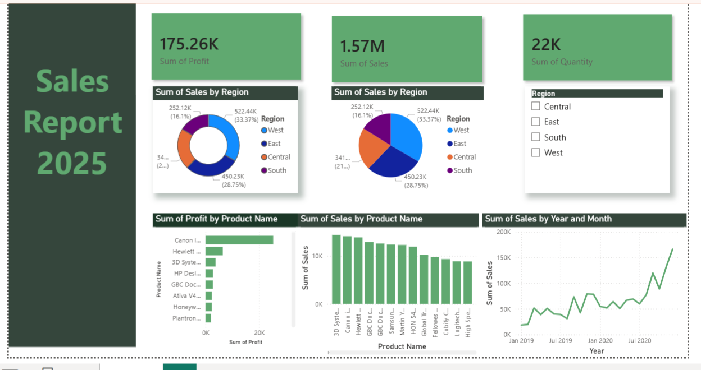

# 📊 Data Cleaning & Visualization Project

## Overview
This project focuses on cleaning and visualizing the SuperStore Sales dataset using Microsoft Power BI to generate meaningful business insights.

## Tools Used
- Microsoft Excel
- Microsoft Power BI

## Files
- `SuperStore Sales DataSet.xlsx` – Dataset
- `sales.pbix` – Power BI dashboard
- `sales dashboard.png` – Dashboard preview

## Features
- Data Cleaning
- Interactive Dashboard
- Sales & Profit Analysis
- Region and Category-wise Insights

## Dashboard Preview

## Author
Your Name
